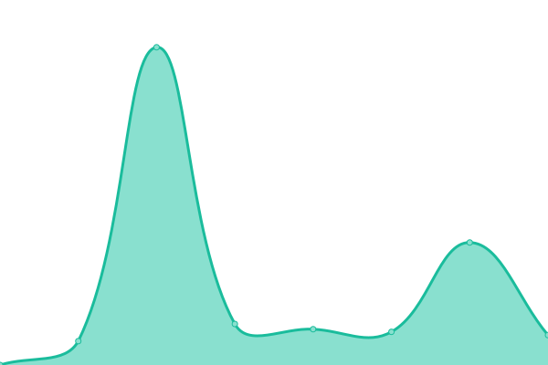

# [📈 Live Status](https://up.pageon.be): <!--live status--> **🟧 Partial outage**

<!--start: status pages-->
<!-- This summary is generated by Upptime (https://github.com/upptime/upptime) -->
<!-- Do not edit this manually, your changes will be overwritten -->
<!-- prettier-ignore -->
| URL | Status | History | Response Time | Uptime |
| --- | ------ | ------- | ------------- | ------ |
|  [Pageon](https://www.pageon.be) | 🟩 Up | [pageon.yml](https://github.com/pageon/uptime/commits/HEAD/history/pageon.yml) | 

 1598ms
     
 | 

<a href="https://up.pageon.be/history/pageon">97.09%</a>
    

|  [Kind van God](https://blog.kindvangod.be) | 🟩 Up | [kind-van-god.yml](https://github.com/pageon/uptime/commits/HEAD/history/kind-van-god.yml) | 

 1245ms
     
 | 

<a href="https://up.pageon.be/history/kind-van-god">96.66%</a>
    

|  [Carakas](https://poetry.carakas.be) | 🟩 Up | [carakas.yml](https://github.com/pageon/uptime/commits/HEAD/history/carakas.yml) | 

 1596ms
     
 | 

<a href="https://up.pageon.be/history/carakas">97.00%</a>
    

|  [Arise](https://arisefotografie.be) | 🟩 Up | [arise.yml](https://github.com/pageon/uptime/commits/HEAD/history/arise.yml) | 

 1695ms
     
 | 

<a href="https://up.pageon.be/history/arise">96.39%</a>
    

|  [De bock verschooris](http://debockverschooris.be) | 🟩 Up | [de-bock-verschooris.yml](https://github.com/pageon/uptime/commits/HEAD/history/de-bock-verschooris.yml) | 

 1386ms
     
 | 

<a href="https://up.pageon.be/history/de-bock-verschooris">97.24%</a>
    

|  [Caros](http://carosbeauty.be) | 🟩 Up | [caros.yml](https://github.com/pageon/uptime/commits/HEAD/history/caros.yml) | 

 1495ms
     
 | 

<a href="https://up.pageon.be/history/caros">97.26%</a>
    

|  [Train me](http://train-me.be) | 🟥 Down | [train-me.yml](https://github.com/pageon/uptime/commits/HEAD/history/train-me.yml) | 

 0ms
     
 | 

<a href="https://up.pageon.be/history/train-me">0.00%</a>
    

|  [evadoc](http://evadoc.be) | 🟥 Down | [evadoc.yml](https://github.com/pageon/uptime/commits/HEAD/history/evadoc.yml) | 

 3948ms
     
 | 

<a href="https://up.pageon.be/history/evadoc">96.69%</a>
    

|  [Every Nation Campus Gent](http://everynationcampusgent.org) | 🟩 Up | [every-nation-campus-gent.yml](https://github.com/pageon/uptime/commits/HEAD/history/every-nation-campus-gent.yml) | 

 4518ms
     
 | 

<a href="https://up.pageon.be/history/every-nation-campus-gent">96.74%</a>
    

|  [School of intersession](https://www.schoolofintercession.eu) | 🟩 Up | [school-of-intersession.yml](https://github.com/pageon/uptime/commits/HEAD/history/school-of-intersession.yml) | 

 2155ms
     
 | 

<a href="https://up.pageon.be/history/school-of-intersession">96.30%</a>
    

|  [Go internship](https://go-internship.eu) | 🟩 Up | [go-internship.yml](https://github.com/pageon/uptime/commits/HEAD/history/go-internship.yml) | 

 1555ms
     
 | 

<a href="https://up.pageon.be/history/go-internship">96.59%</a>
    

|  [Add your voice today](https://addyourvoicetoday.com) | 🟥 Down | [add-your-voice-today.yml](https://github.com/pageon/uptime/commits/HEAD/history/add-your-voice-today.yml) | 

 0ms
     
 | 

<a href="https://up.pageon.be/history/add-your-voice-today">0.00%</a>
    

|  [Add upir voice](https://addyourvoice.today) | 🟥 Down | [add-upir-voice.yml](https://github.com/pageon/uptime/commits/HEAD/history/add-upir-voice.yml) | 

 0ms
     
 | 

<a href="https://up.pageon.be/history/add-upir-voice">0.00%</a>
    

|  [Every Nation Lisboa](https://everynationlisboa.org) | 🟥 Down | [every-nation-lisboa.yml](https://github.com/pageon/uptime/commits/HEAD/history/every-nation-lisboa.yml) | 

 1747ms
     
 | 

<a href="https://up.pageon.be/history/every-nation-lisboa">96.83%</a>
    

|  [Ik geloof in Tielt](https://ikgeloofintielt.be) | 🟩 Up | [ik-geloof-in-tielt.yml](https://github.com/pageon/uptime/commits/HEAD/history/ik-geloof-in-tielt.yml) | 

 0ms
     
 | 

<a href="https://up.pageon.be/history/ik-geloof-in-tielt">100.00%</a>
    

|  [Naamcirkels](https://naamcirkels.be) | 🟩 Up | [naamcirkels.yml](https://github.com/pageon/uptime/commits/HEAD/history/naamcirkels.yml) | 

 5388ms
     
 | 

<a href="https://up.pageon.be/history/naamcirkels">96.86%</a>
    

|  [Feniks](https://feniksateljee.be) | 🟩 Up | [feniks.yml](https://github.com/pageon/uptime/commits/HEAD/history/feniks.yml) | 

 4268ms
     
 | 

<a href="https://up.pageon.be/history/feniks">96.88%</a>
    

|  [Percecution](https://www.persecution.be) | 🟩 Up | [percecution.yml](https://github.com/pageon/uptime/commits/HEAD/history/percecution.yml) | 

 449ms
     
 | 

<a href="https://up.pageon.be/history/percecution">100.00%</a>
    

|  [Vervolging](https://www.vervolging.be) | 🟩 Up | [vervolging.yml](https://github.com/pageon/uptime/commits/HEAD/history/vervolging.yml) | 

 444ms
     
 | 

<a href="https://up.pageon.be/history/vervolging">100.00%</a>
    

|  [Stagepro](http://stagepro.be) | 🟩 Up | [stagepro.yml](https://github.com/pageon/uptime/commits/HEAD/history/stagepro.yml) | 

 4033ms
     
 | 

<a href="https://up.pageon.be/history/stagepro">98.40%</a>
    

|  [mtcspoor6](http://mtcspoor6.be) | 🟩 Up | [mtcspoor6.yml](https://github.com/pageon/uptime/commits/HEAD/history/mtcspoor6.yml) | 

 1335ms
     
 | 

<a href="https://up.pageon.be/history/mtcspoor6">98.42%</a>
    

|  [Masterhouse](https://masterhouse.be) | 🟩 Up | [masterhouse.yml](https://github.com/pageon/uptime/commits/HEAD/history/masterhouse.yml) | 

 6676ms
     
 | 

<a href="https://up.pageon.be/history/masterhouse">97.72%</a>
    

|  [Norbert Roose](http://norbertroose.be) | 🟩 Up | [norbert-roose.yml](https://github.com/pageon/uptime/commits/HEAD/history/norbert-roose.yml) | 

 3613ms
     
 | 

<a href="https://up.pageon.be/history/norbert-roose">98.43%</a>
    

|  [Ik geloof in vlaanderen](https://ikgeloofinvlaanderen.be) | 🟩 Up | [ik-geloof-in-vlaanderen.yml](https://github.com/pageon/uptime/commits/HEAD/history/ik-geloof-in-vlaanderen.yml) | 

 0ms
     
 | 

<a href="https://up.pageon.be/history/ik-geloof-in-vlaanderen">98.73%</a>
    

|  [Grandes nouvelles](https://grandesnouvelles.be) | 🟥 Down | [grandes-nouvelles.yml](https://github.com/pageon/uptime/commits/HEAD/history/grandes-nouvelles.yml) | 

 0ms
     
 | 

<a href="https://up.pageon.be/history/grandes-nouvelles">0.00%</a>
    

|  [Educando](http://educando.be) | 🟩 Up | [educando.yml](https://github.com/pageon/uptime/commits/HEAD/history/educando.yml) | 

 2715ms
     
 | 

<a href="https://up.pageon.be/history/educando">97.52%</a>
    

|  [Connaitre Dieu](https://connaitredieu.com) | 🟩 Up | [connaitre-dieu.yml](https://github.com/pageon/uptime/commits/HEAD/history/connaitre-dieu.yml) | 

 1345ms
     
 | 

<a href="https://up.pageon.be/history/connaitre-dieu">100.00%</a>
    

|  [XEE](https://xee.works) | 🟩 Up | [xee.yml](https://github.com/pageon/uptime/commits/HEAD/history/xee.yml) | 

 1867ms
     
 | 

<a href="https://up.pageon.be/history/xee">98.47%</a>
    

|  [Feet up](https://feet-up.be) | 🟩 Up | [feet-up.yml](https://github.com/pageon/uptime/commits/HEAD/history/feet-up.yml) | 

 3934ms
     
 | 

<a href="https://up.pageon.be/history/feet-up">98.22%</a>
    

|  [Dock 66](https://dock66.be) | 🟥 Down | [dock-66.yml](https://github.com/pageon/uptime/commits/HEAD/history/dock-66.yml) | 

 0ms
     
 | 

<a href="https://up.pageon.be/history/dock-66">0.00%</a>
    

|  [VEG](https://veg.be) | 🟩 Up | [veg.yml](https://github.com/pageon/uptime/commits/HEAD/history/veg.yml) | 

 3098ms
     
 | 

<a href="https://up.pageon.be/history/veg">98.16%</a>
    

|  [Open deur vzw](http://opendeurvzw.be) | 🟩 Up | [open-deur-vzw.yml](https://github.com/pageon/uptime/commits/HEAD/history/open-deur-vzw.yml) | 

 2235ms
     
 | 

<a href="https://up.pageon.be/history/open-deur-vzw">97.17%</a>
    

|  [Fantastic wheels](https://fantasticwheels.be) | 🟩 Up | [fantastic-wheels.yml](https://github.com/pageon/uptime/commits/HEAD/history/fantastic-wheels.yml) | 

 4466ms
     
 | 

<a href="https://up.pageon.be/history/fantastic-wheels">97.43%</a>
    

|  [Dreambaits](https://www.dreambaits.be/en) | 🟩 Up | [dreambaits.yml](https://github.com/pageon/uptime/commits/HEAD/history/dreambaits.yml) | 

 1322ms
     
 | 

<a href="https://up.pageon.be/history/dreambaits">100.00%</a>
    

|  [De kruispoort](https://dekruispoort.be/nl) | 🟩 Up | [de-kruispoort.yml](https://github.com/pageon/uptime/commits/HEAD/history/de-kruispoort.yml) | 

 2038ms
     
 | 

<a href="https://up.pageon.be/history/de-kruispoort">97.87%</a>
    

|  [Bijbeldag](https://bijbeldag.be) | 🟩 Up | [bijbeldag.yml](https://github.com/pageon/uptime/commits/HEAD/history/bijbeldag.yml) | 

 4527ms
     
 | 

<a href="https://up.pageon.be/history/bijbeldag">98.15%</a>
    

<!--end: status pages-->

[**Visit our status website →**](https://up.pageon.be)

## 📄 License

- Powered by: [Upptime](https://github.com/upptime/upptime)
- Code: [MIT](./LICENSE) © [pageon](https://uptime.pageon.be)
- Data in the `./history` directory: [Open Database License](https://opendatacommons.org/licenses/odbl/1-0/)
